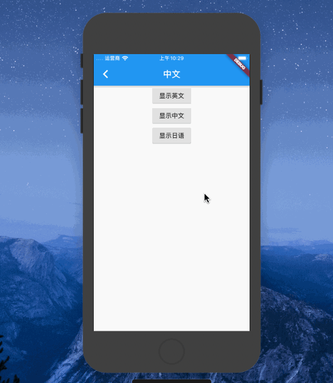

# Flutter应用的国际化
> 记录下安装和配置Flutter应用的国际化，以iOS项目作为示例

#### 1、安装 
`pubspec.yaml`文件添加如下配置，保存

```
#多语言
  flutter_localizations:
    sdk: flutter
```

#### 2、配置

`MaterialApp` 组件下配置如下参数

```
//国际化配置
localizationsDelegates: [
    // 注册一个新的delegate
	_localeOverrideDelegate,  
	// 指向默认的处理翻译逻辑的库
	const TranslationsDelegate(), 
	// 本地化的代理类
	GlobalMaterialLocalizations.delegate,
	GlobalWidgetsLocalizations.delegate,
],
supportedLocales: applic.supportedLocales(),
localeResolutionCallback: (Locale locale, Iterable<Locale> supportedLocales) {
	print('当前语言环境是: $locale ，$supportedLocales');
}, 
```

#### 3、iOS项目多语言配置
打开iOS项目，编辑`info.plist`文件，添加需要的配置


#### 4、示例演示


#### 详细参考国际化模块